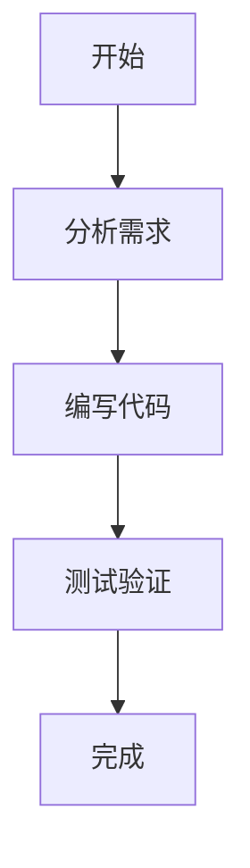

# HEIC2any

基于Python与Qt的HEIC批量转换工具，支持多线程、可暂停/恢复/停止、拖拽添加文件、灵活导出设置与命名 Token 预览，并可自动发现 Conda 环境以便选择合适的运行环境。

## 主要特性
- 批量转换：HEIC→jpg/png/jpeg/tif 等，支持质量、DPI、尺寸调节（滑杆+数值标签）
- 并发性能：可调线程数，多线程处理
- 过程控制：随时暂停/继续/停止，逐项状态与进度
- 目录与命名：选择输入/输出目录、拖拽添加、命名 Token 预览
- Conda 环境：自动发现并选择环境，检测依赖
- 四区布局：顶部主控制、左侧文件队列、右侧检查器、底部状态栏

## 快速开始
1. 安装依赖（推荐在 Conda 环境中）：
   - `pip install -r requirements.txt`
   - 如需支持HEIC，请安装：`pillow-heif` 与 `Pillow`
2. 运行程序：
   - `python main_heic2any.py`

## 流程概览

## 说明
- 若当前环境未安装 `pillow-heif`，程序将提示安装依赖，HEIC 缩略图与转换将降级为占位图/失败提示。
- 停止操作将尽力取消未启动任务，运行中的任务会在当前图片处理完后停止队列提交。

